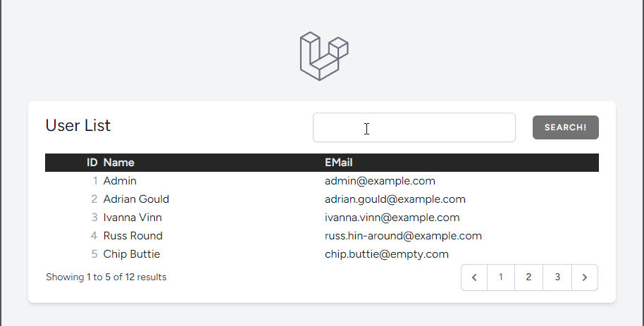

<a name="readme-top"></a>
# Laravel 11 Search Demo

A small demo on creating a search box for laravel.


#### Built With

[![PHP][Php.com]][Php-url]
[![Laravel][Laravel.com]][Laravel-url]
[![Tailwindcss][Tailwindcss.com]][Tailwindcss-url]


## Description

The demonstration shows how to add a search to a list of users using the whereAny method
introduced with Laravel 10.47.

This demo using SQLite.



_Image: The search being demonstrated._

## Credits

- Redmond, P. (2024). Query Builder whereAll() and whereAny() Methods Added to Laravel
  10.47. [online] Laravel News. Available
  at: https://laravel-news.com/laravel-10-47-0 [Accessed 22 May 2024].
- Ramadhani, I. (2023). Search in Laravel. [online] Medium. Available
  at: https://medium.com/@iqbal.ramadhani55/search-in-laravel-e0e20f329b01 [Accessed 22 May 2024].

<p align="right">(<a href="#readme-top">back to top</a>)</p>


## Badges

[![Forks][forks-shield]][forks-url]
[![Downloads][downloads-shield]][downloads-url]

[![Languages][languages-shield]][languages-url]
[![Issues][issues-shield]][issues-url]


<p align="right">(<a href="#readme-top">back to top</a>)</p>


## Installation

Clone this repository:

```shell
git clone https://github.com/AdyGCode/laravel-11-search-demo.git
```

Change into the folder:

```shell
cd laravel-11-search-demo
```

Install the requirements for the project:

```shell
composer install
npm i && npm upgrade
```

Copy the `.env-sqlite` file renaming it `.env`
```shell
cp .env-sqlite .env
```

If needed change the `APP_URL=http://laravel-11-search-demo.test` in the `.env` to 
`APP_URL=http://localhost`.

Generate an APP Key:
```shell
php artisan key:generate
```

<p align="right">(<a href="#readme-top">back to top</a>)</p>

### Laragon users
If using Laragon or similar to run the site, stop Apache and restart it.

Now visit: http://laravel-11-search-demo.test

### Using PHP Artisan Serve

If you wish to use the built-in PHP server then run:
```
php artisan serve
```

Now visit: http://localhost

<p align="right">(<a href="#readme-top">back to top</a>)</p>


<!-- MARKDOWN LINKS & IMAGES -->
<!-- https://www.markdownguide.org/basic-syntax/#reference-style-links -->

[forks-shield]: http://img.shields.io/github/forks/adygcode/laravel-11-search-demo.svg?style=for-the-badge
[forks-url]: https://github.com/AdyGCode/laravel-11-search-demo/network/members

[languages-shield]: http://img.shields.io/github/languages/count/adygcode/laravel-11-search-demo.svg?style=for-the-badge
[languages-url]: https://github.com/AdyGCode/laravel-11-search-demo/network/members

[downloads-shield]: http://img.shields.io/github/downloads/adygcode/laravel-11-search-demo/total?style=for-the-badge
[downloads-url]: https://github.com/AdyGCode/laravel-11-search-demo/network/members

[issues-shield]: http://img.shields.io/github/issues/adygcode/laravel-11-search-demo.svg?style=for-the-badge
[issues-url]: https://github.com/adygcode/laravel-11-search-demo/issues

[licence-shield]: https://img.shields.io/badge/opensourceinitiative-3DA639?style=for-the-badge
[licence-url]: https://github.com/adygcode/laravel-11-search-demo/blob/main/License.md

[product-screenshot]: _docs/images/animated-demo.gif

[Laravel.com]: https://img.shields.io/badge/Laravel-FF2D20?style=for-the-badge&logo=laravel&logoColor=white
[Laravel-url]: https://laravel.com

[Tailwindcss.com]: https://img.shields.io/badge/Tailwindcss-06B6D4?style=for-the-badge&logo=tailwindcss&logoColor=white
[Tailwindcss-url]: https://tailwindcss.com


[Php.com]: https://img.shields.io/badge/Php-777BB4?style=for-the-badge&logo=php&logoColor=white
[Php-url]: https://inertiajs.com
